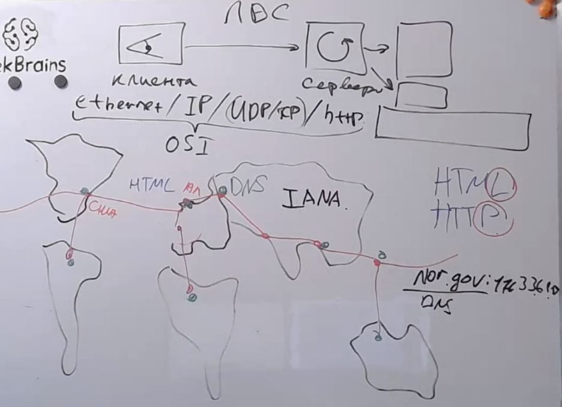
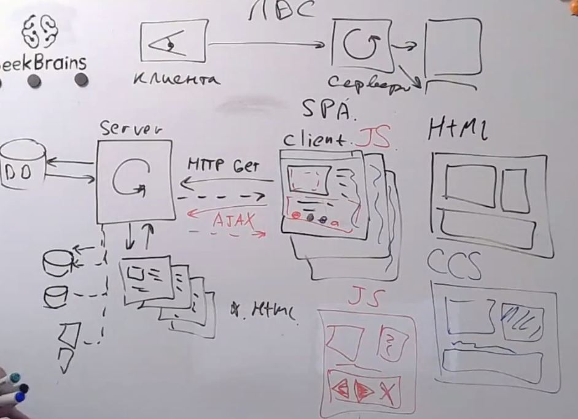
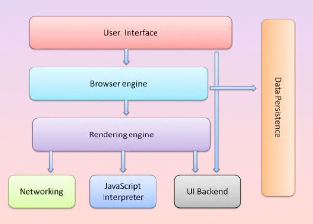
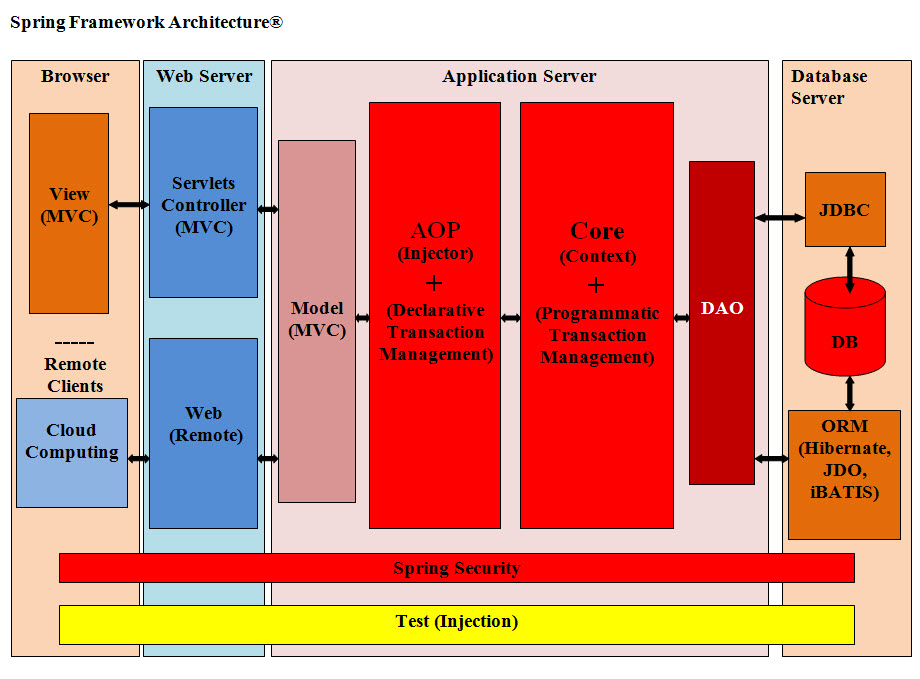
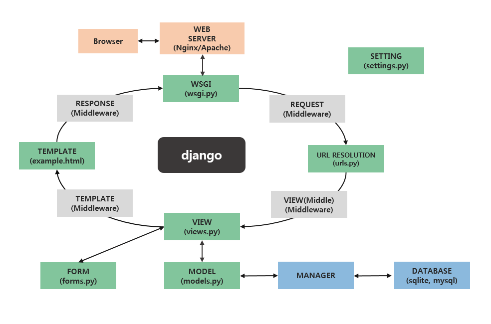
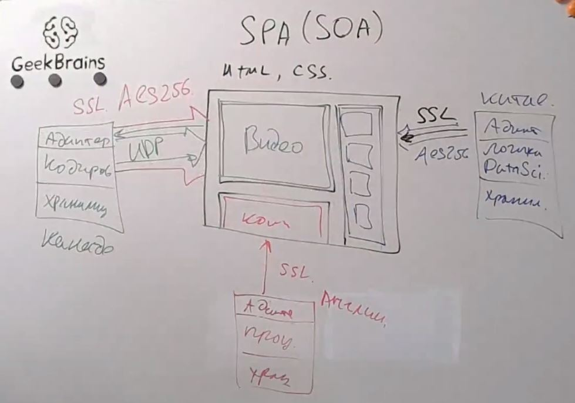
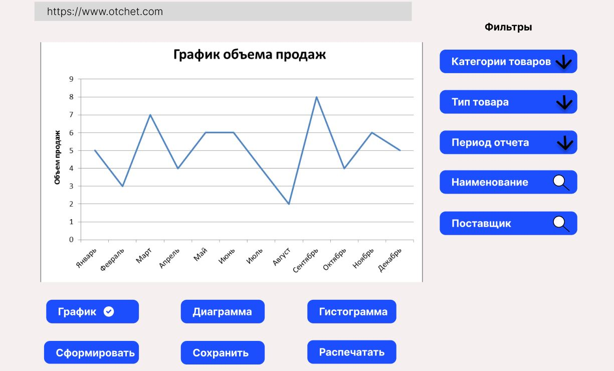
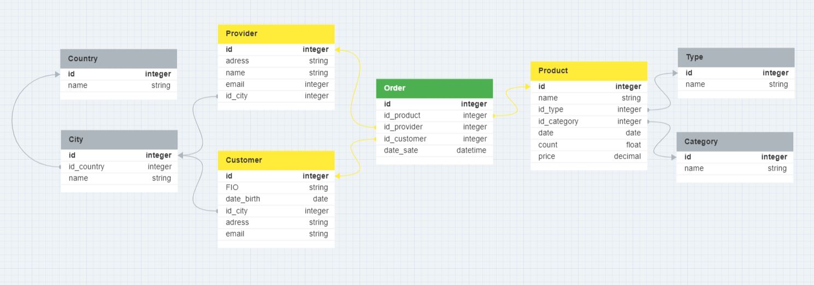
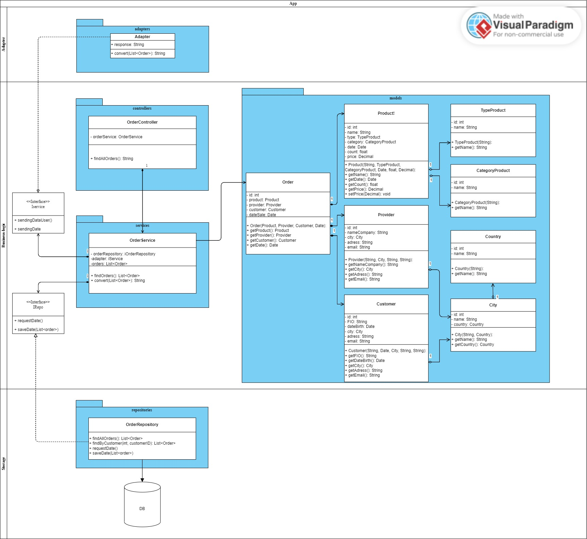

# Урок 7. Типа архитектур WEB-приложений: MPA, SPA.
## Classwork
Развитие интернета:

Современный интернет:

Современный интернет(Архитектура браузера):

ASP.net Core Arch:

Spring_MVC:

DJANGO_ARCH:

SPA (SOA) на примере YOUTUBE:

## Homework
1. Доработать экранные формы интерфейса в https://www.figma.com/ или https://app.diagrams.net/.

2. Разработать полную ERD домена в https://www.dbdesigner.net/.

3. Разработать диаграмму компонент в UML включая слои пользовательского интерфейса и бизнес-логики.

Все диаграммы сделать к разработанному на семинаре примеру системы отчетов оптовой компании